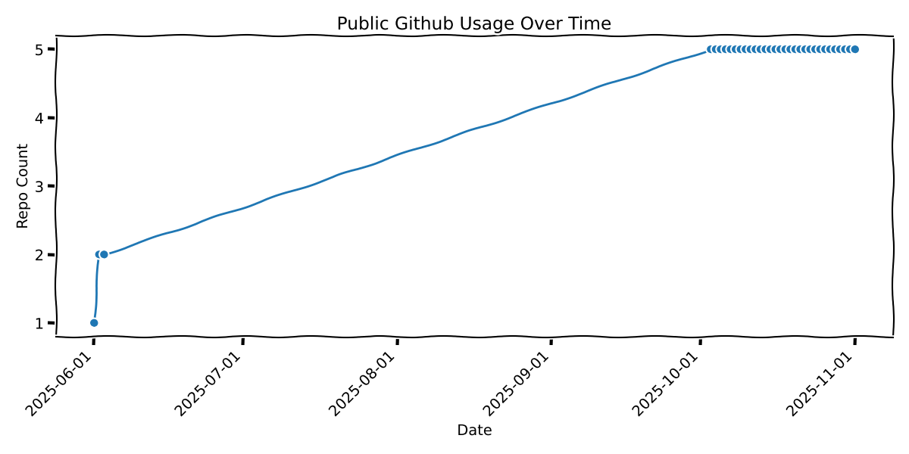

# GC Secure Artifacts

Shared Services Canada (SSC) has initiated a one-year pilot project of [GC Secure Artifacts](https://artifacts-artefacts.devops.cloud-nuage.canada.ca), a secure, scalable, centralized artifact management service underpinned by the JFrog Enterprise+ platform, self-hosted on the GC Private Cloud.

- https://artifacts-artefacts.devops.cloud-nuage.canada.ca

Available to all federal departments and agencies, this service represents SSC's initial venture into a unified DevSecOps service, designed to bolster software supply chain security and expedite delivery across the Government of Canada. Outcomes of this pioneering initiative will contribute to the decision-making process regarding the project's long-term sustainability and potential expansion.

For access to GC Secure Artifacts, please completing the following GC Form:

- [GC Secure Artifacts Onboarding Form](https://forms-formulaires.alpha.canada.ca/en/id/cmavw8p4l006eyi01cx1qtxxd)

## Continual Compliance Report

| Security Control | Continual Validation Status |
|---|---|
|SD-3|[](../../actions/workflows/super-linter.yml)|

## Build Statuses


## Background

This service supports the Government of Canada's efforts to reduce duplication. While departments currently maintain independent Artifactory instances, a centralized approach provides potential access to advanced features. These features, such as JFrog Advanced Security and/or Runtime, could be cost-prohibitive for individual departments but become feasible through pooled resources. By offering a unified secure service, we can improve cybersecurity and delivery speed while creating potential for significant savings.

GC Secure Artifacts, by consolidating efforts across departments, aims to:

- **Reduce duplication**: Eliminate the need for each department to purchase and manage its own tools.
- **Strengthen national security**: Through standardizing controls and policies involving software supply chains.
- **Accelerate development**: Enables developer teams to reuse trusted components without waiting for manual security approvals.
- **Support compliance**: Maintains traceability throughout the Software Development Life Cycle (SDLC) to meet audit and policy demands.

For further insight into the GC Secure Artifacts initiative, below is an presentation (unclassified) previously presented at the Architectural Review Committee at SSC.

- [GC Secure Artifacts Presentation](https://gccloudone.blob.core.windows.net/artifacts-artefacts/unclassified/gc-secure-artifacts.pptx)


## Github Public Adoption


As the days go by, you can see how the count evolves… here is our github public adoption(Search Results).

## Features

### JFrog Platform

JFrog Platform (Enterprise Plus) offers an enterprise-grade solution for publishing and consuming build artifacts and container images.

The platform provides:

* A centralized registry for internal builds and deployments
* Advanced access controls and repository segmentation
* Built-in vulnerability scanning (via JFrog Xray)
* Support for multiple package types (Docker, Maven, NPM, Nuget, Helm, etc.)

### Chainguard Secure Images

Chainguard is a robust security tool with no known Common Vulnerabilities and Exposures (CVEs), indicating a high level of safety. The images it provides are distroless, minimal, signed, and Software Bill of Materials (SBOM) enabled, serving as a secure-by-default base layer for application development.

These images have been set up as a pull through from Chainguard's registry to our JFrog Artifactory instance and available to anyone from within the GC.

The container images which are available:

* Python
* OpenJDK (JDK & JRE)
* PowerShell
* Node.js
* ASP.NET Runtime
* .NET Runtime
* .NET SDK

## Implementation Examples

This repository includes practical examples demonstrating how to integrate JFrog Platform and Chainguard Images in your CI/CD workflows.

### Quick Start

**Replace standard base images with Chainguard equivalents:**
```dockerfile
# Python
FROM artifacts-artefacts.devops.cloud-nuage.canada.ca/docker-chainguard-remote/ssc-spc.gc.ca/python:3.13.3

# Java
FROM artifacts-artefacts.devops.cloud-nuage.canada.ca/docker-chainguard-remote/ssc-spc.gc.ca/jre:openjdk-21

# Node.js
FROM artifacts-artefacts.devops.cloud-nuage.canada.ca/docker-chainguard-remote/ssc-spc.gc.ca/node:24.1.0
```

**Add JFrog CLI to your GitHub Actions:**
```yaml
- name: Setup JFrog CLI
  uses: jfrog/setup-jfrog-cli@v4
  env:
    JF_URL: https://artifacts-artefacts.devops.cloud-nuage.canada.ca
    JF_USER: ${{ secrets.JFROG_USERNAME }}
    JF_ACCESS_TOKEN: ${{ secrets.JFROG_JWT_TOKEN }}
```

**Enable security scanning:**
```yaml
- name: Scan Dependencies
  run: jf audit --format=simple

- name: Scan Container
  run: jf docker scan $IMAGE_TAG
```

### Working Examples

The repository contains complete implementation examples:

```
examples/
├── java-app/          # Java application with JFrog + Chainguard integration
├── python-app/        # Python application example
├── node-app/          # Node.js application example
└── .github/workflows/ # Complete CI/CD workflow templates
```

Each example demonstrates:
- JFrog CLI dependency scanning
- Chainguard image integration
- Container vulnerability scanning
- Frogbot pull request security
- Cost optimization features

### Repository Setup

Configure these secrets in your GitHub repository:
- `JFROG_USERNAME`: Your Artifactory username
- `JFROG_JWT_TOKEN`: Your Artifactory access token

### Local Development

**Configure JFrog CLI:**
```bash
jf config add --url=https://artifacts-artefacts.devops.cloud-nuage.canada.ca
jf rt ping
jf audit
```

**Access Chainguard Images:**
```bash
docker login artifacts-artefacts.devops.cloud-nuage.canada.ca
docker pull artifacts-artefacts.devops.cloud-nuage.canada.ca/docker-chainguard-remote/ssc-spc.gc.ca/python:3.13.3
```

## Additional Documentation

For more detailed information on our project standards and guidelines, kindly refer to the following documents:

- [Artifactory Standards](./docs/artifactory-standards.md)
- [Chainguard Images](./docs/chainguard-images.md)
- [Quick Start Guide](./QUICKSTART.md)
- Additional documents will be uploaded soon

## Feedback and Contributions

We appreciate and welcome your inputs and suggestions to continuously improve this service to support departmental and/or agency needs.

Feel free to share your feedback by emailing us at [devops.artifacts-artefacts.devops@ssc-spc.gc.ca](mailto:devops.artifacts-artefacts.devops@ssc-spc.gc.ca).

## Resources

* [Chainguard](https://chainguard.dev/)
* [JFrog Devops Platform](https://jfrog.com/)
* [jFrog Academy](https://academy.jfrog.com/)
